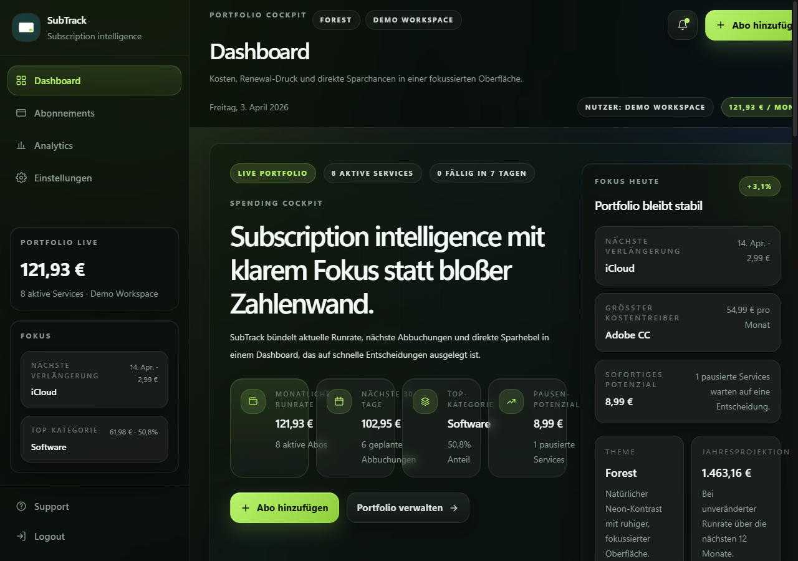
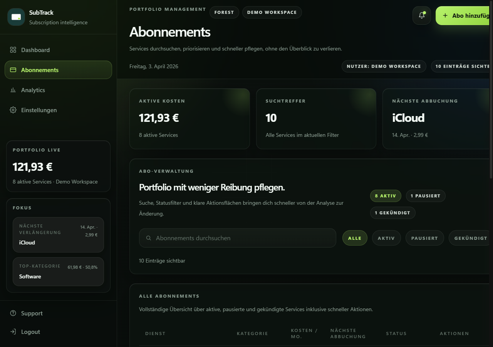
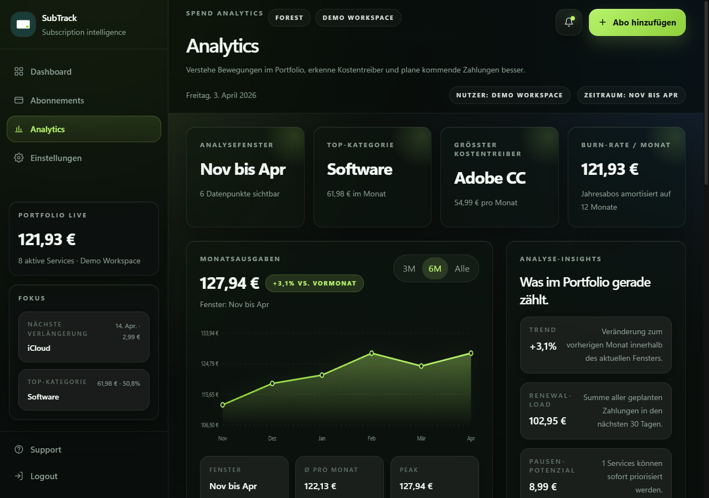
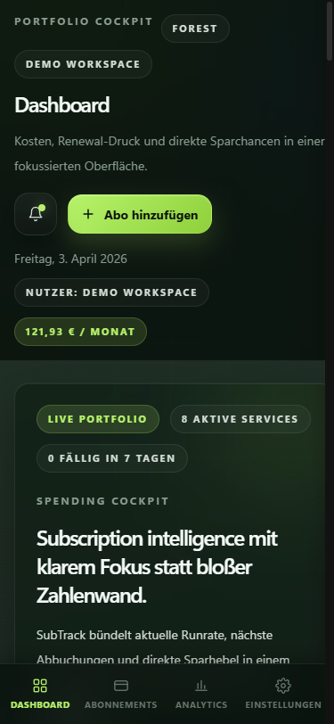
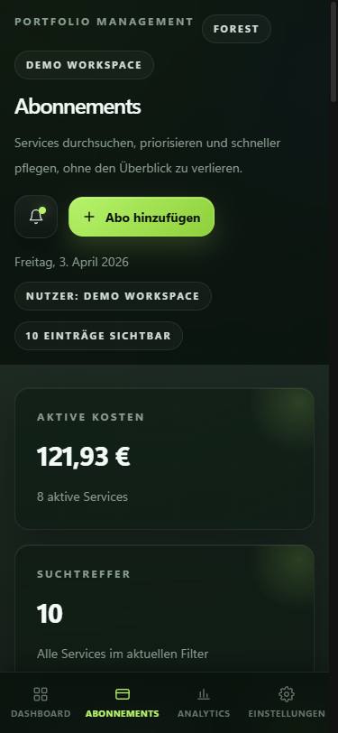
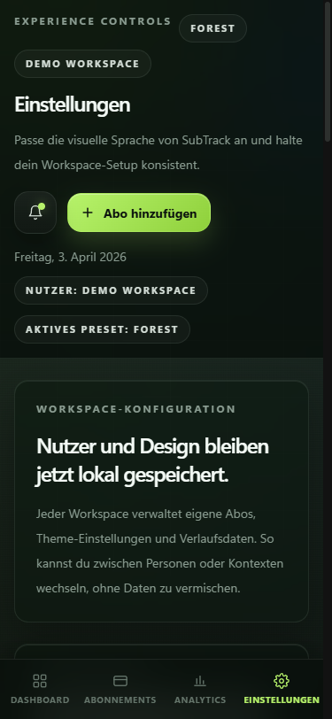

# SubTrack

SubTrack is a polished subscription intelligence dashboard built with React and Vite. It helps users understand recurring costs, upcoming renewals, portfolio composition, and savings opportunities in a fast, visual, finance-style interface.

It is intentionally frontend-only: no backend, no sign-in, no external API dependency at runtime. The repository is a strong starting point for building a production-ready subscription tracker, cost cockpit, or personal finance SaaS prototype.

→ **[Roadmap v1.0](ROADMAP.md)** — see what's done, what's in progress, and what's coming next.

## Screenshots

### Dashboard



### Subscription Management



### Analytics



### Responsive Mobile Views

<p>
  
  
  
</p>

## What The Project Includes

- A high-contrast dashboard with monthly spend, renewals, burn-rate analysis, trial tracker, and portfolio highlights
- A responsive subscription management view with search, status filters, quick actions, and swipe-to-delete on mobile
- Custom SVG charts: spend history bar chart, category donut, and a 12-month area chart with hover tooltip
- A structured add/edit modal with plan lookup, trial end-date support, live preview, and monthly-value normalization
- Multi-currency support: EUR, USD, GBP, and CHF selectable in settings, formatted via `Intl.NumberFormat`
- Glassmorphism 2.0 UI: consistent `backdrop-blur` glass cards across all surfaces and themes
- Responsive layout: bottom navigation bar on mobile, icon-only sidebar on tablet, full sidebar on desktop
- Framer Motion animations: staggered stats cards, page transitions, modal scale-in/out, and empty-state entrance
- Empty state onboarding screen shown when no subscriptions exist
- Trial Tracker: color-coded badges (red/orange/amber) for expiring trials, dashboard warning section
- Local user workspaces with separate subscription data, themes, and history persisted in `localStorage`
- Multiple visual presets with persistent theme selection via `localStorage`
- Hash-based deep links for core screens: `#dashboard`, `#subscriptions`, `#analytics`, and `#settings`
- A curated demo dataset with category colors, icons, billing dates, trial dates, and German-market example pricing
- 46 automated unit tests covering date utilities, price lookup, and billing calculations

## Why SubTrack

Many subscription dashboards stop at showing a table of services. SubTrack pushes further by focusing on:

- Information hierarchy: the most important cost and renewal signals are visible immediately
- Decision support: paused subscriptions, top categories, and renewal pressure are surfaced as actionable insights
- Responsive usability: the same product remains usable on narrow mobile viewports without falling apart
- Design quality: the UI aims for product-level polish rather than a default admin-template look

## Tech Stack

| Layer | Tooling |
| --- | --- |
| UI | React 19 |
| Build tooling | Vite 8 |
| Styling | Tailwind CSS 4 plus custom CSS tokens/components |
| Animation | Framer Motion |
| Charts | Hand-built SVG components |
| Testing | Vitest 3 + @vitest/coverage-v8 |
| Linting | ESLint 9 |

## Feature Overview

### 1. Dashboard

The dashboard is the main decision surface. It combines:

- live monthly run rate (burn-rate with yearly subscription amortization)
- 30-day renewal load
- category concentration
- trial tracker section: upcoming trial expirations with color-coded urgency
- spend trend over time
- direct navigation into management workflows

### 2. Subscription Management

The subscriptions area supports:

- searching by service name
- filtering by active, paused, and cancelled status
- editing and deleting entries
- swipe-to-delete gesture on mobile with animated slide-out and red delete indicator
- optimized mobile cards for smaller screens
- trial end-date tracking with color-coded badge per entry
- empty state onboarding screen when no subscriptions exist

### 3. Analytics

The analytics page provides:

- burn-rate KPI: total monthly cost with yearly subscriptions amortized over 12 months
- 12-month area chart: rolling spend trend with hover tooltip
- a selectable time window for spend history bar chart
- trend vs. previous month
- peak period visibility
- category composition donut chart
- renewal pressure context

### 4. Settings

Settings focus on workspace and visual customization:

- multi-currency selector: EUR, USD, GBP, CHF — applied globally across all views
- local browser persistence for multiple users
- multiple curated color presets (Forest, Ocean, Dusk, Ember, Rose)
- per-user persistent theme selection
- live workspace-style preview

### 5. Price Lookup

The subscription modal includes a lookup helper based on a curated service database. It is intended to speed up data entry by suggesting common services and plan prices and normalizing them to monthly equivalents for consistent analytics.

## Getting Started

### Prerequisites

- Node.js 18 or newer
- npm 9 or newer

### Installation

```bash
git clone https://github.com/Morgos9/subtrack.git
cd subtrack/app
npm install
```

### Run The Development Server

```bash
npm run dev
```

By default, Vite starts the app on:

```text
http://localhost:5173
```

### Build For Production

```bash
npm run build
```

### Preview The Production Build

```bash
npm run preview
```

### Lint The Project

```bash
npm run lint
```

## Repository Structure

```text
app/
├── docs/
│   └── screenshots/            # README screenshots and public repo assets
├── public/
│   ├── favicon.svg
│   └── icons.svg
├── src/
│   ├── assets/
│   │   ├── hero.png
│   │   ├── logo.png
│   │   ├── react.svg
│   │   └── vite.svg
│   ├── components/
│   │   ├── AreaChart.jsx           # 12-month spend area chart (SVG)
│   │   ├── BarChart.jsx
│   │   ├── DonutChart.jsx
│   │   ├── EmptyState.jsx          # onboarding screen for new users
│   │   ├── LineChart.jsx
│   │   ├── SubscriptionModal.jsx
│   │   ├── SubscriptionTable.jsx
│   │   ├── TipsPanel.jsx
│   │   ├── TrialBadge.jsx          # color-coded trial expiry badge
│   │   ├── UpcomingBills.jsx
│   │   └── UserWorkspacePanel.jsx
│   ├── data/
│   │   └── subscriptions.js    # seed data and category tokens
│   ├── utils/
│   │   ├── date.js             # local date helpers
│   │   └── priceLookup.js      # curated service lookup database
│   ├── App.css
│   ├── App.jsx                 # page orchestration and app shell
│   ├── index.css               # tokens, component classes, responsive styles
│   └── main.jsx
├── index.html
├── package.json
├── vite.config.js
└── README.md
```

## Architecture Notes

### Application Model

SubTrack is a single-page React application with view switching handled in component state. The active section is synchronized to the URL hash so each major area can be linked directly.

### State Management

The project currently uses local React state only:

- subscriptions live in memory
- theme selection is stored in `localStorage`
- no backend persistence is implemented yet

This keeps the repository easy to clone, run, and extend without infrastructure.

### Charts

Charts are implemented as composable SVG components. This keeps bundle size lean and makes it easier to fine-tune the visual language without a third-party charting abstraction.

### Date Handling

The app intentionally uses local-date helpers for `YYYY-MM-DD` values to avoid UTC parsing surprises in browsers.

## Customization Guide

### Seed Data

Edit `src/data/subscriptions.js` to:

- change the demo portfolio
- update category labels/colors
- adjust monthly history points

### Theme Tokens

Edit `src/index.css` to adjust:

- base backgrounds
- surface and border colors
- accent colors
- typography and panel styles

### Lookup Database

Edit `src/utils/priceLookup.js` to:

- add more services
- update plan names
- adapt pricing to another market

## Current Limitations

This repository is intentionally focused on frontend product quality and fast local iteration. At the moment it does not include:

- authenticated multi-user support across devices
- server-side data syncing
- import/export flows (CSV / bank statement parsing)

## Roadmap

See **[ROADMAP.md](ROADMAP.md)** for the full prioritized roadmap. Strong next steps include:

- TypeScript migration (Phase 0)
- Zustand global state management (Phase 0)
- PWA support — installable as standalone app (Phase 4)
- CSV import/export — parse bank exports (Phase 4)
- Supabase auth and real-time sync (Phase 4)
- Savings Coach — AI-based subscription suggestions (Phase 5)

## Accessibility And UX Notes

The UI improvements in this version focus on:

- better mobile navigation
- larger tap targets for key actions
- clearer panel hierarchy
- stronger contrast in actionable controls
- responsive subscription management without horizontal scrolling on mobile

## Contributing

Contributions are welcome.

Recommended workflow:

1. Fork the repository
2. Create a feature branch
3. Make your changes
4. Run `npm run lint`
5. Run `npm run build`
6. Open a pull request

If you plan a larger feature, opening an issue first is appreciated.

## License

This project is licensed under the [MIT License](LICENSE).
