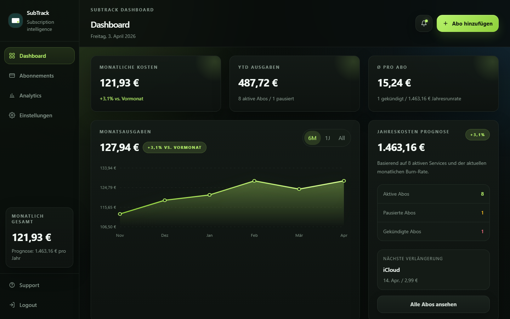
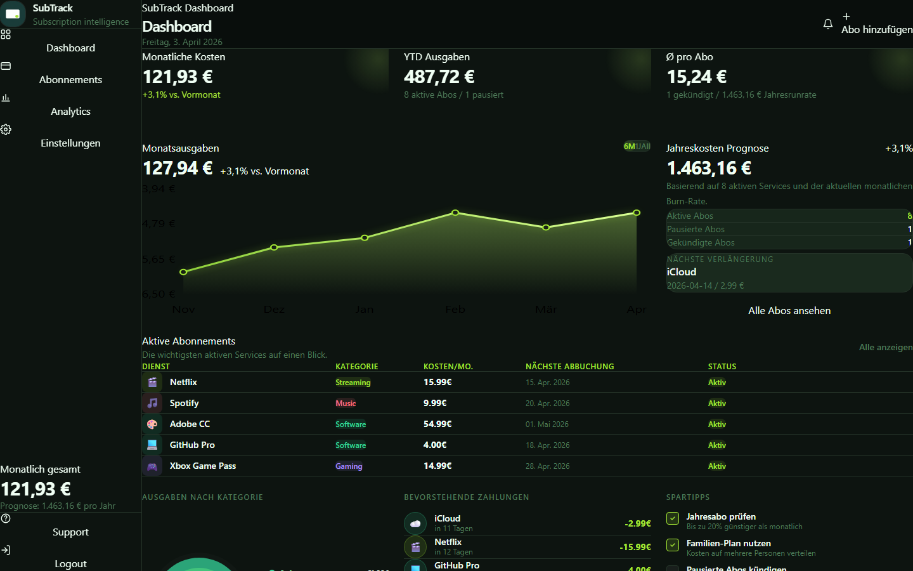
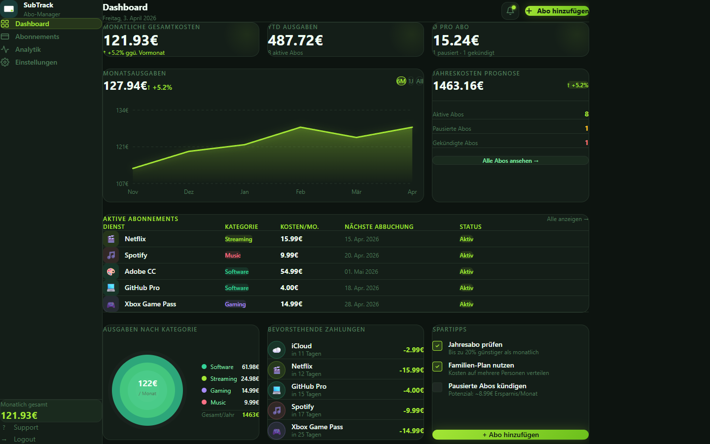

# SubTrack

A clean, finance-style subscription management dashboard built with React and Vite.



## Features

- **Dashboard overview** — monthly spend summary, category breakdown donut chart, spend trend line chart, and upcoming bills
- **Subscription management** — add, edit, delete, and pause subscriptions in a sortable/filterable table
- **Price lookup** — smart search with 40+ pre-filled services (EUR prices, German market) and fuzzy matching
- **Analytics page** — bar chart with monthly history and per-category cost breakdown
- **Settings page** — currency, notification, and display preferences
- **Fully client-side** — no backend, no account required, data stored in memory

## Tech Stack

| Layer | Library / Tool |
|---|---|
| UI framework | React 19 |
| Build tool | Vite 8 |
| Styling | Tailwind CSS 4 |
| Charts | Pure SVG (no chart library) |
| Linting | ESLint 9 |

## Getting Started

### Prerequisites

- Node.js >= 18
- npm >= 9

### Installation

```bash
# Repository klonen
git clone https://github.com/Morgos9/subtrack.git
cd subtrack/app

# Abhängigkeiten installieren
npm install

# Entwicklungsserver starten
npm run dev
```

The app runs at `http://localhost:5173`.

### Build for production

```bash
npm run build
# Output lands in dist/
```

Preview the production build locally:

```bash
npm run preview
```

## Project Structure

```
app/
├── public/             # Static assets (favicon, icons, logo)
├── src/
│   ├── assets/         # Images used in components
│   ├── components/
│   │   ├── DonutChart.jsx       # Category breakdown (SVG)
│   │   ├── LineChart.jsx        # Monthly spend trend (SVG)
│   │   ├── BarChart.jsx         # Analytics bar chart (SVG)
│   │   ├── SubscriptionTable.jsx
│   │   ├── SubscriptionModal.jsx  # Add / edit dialog
│   │   ├── UpcomingBills.jsx
│   │   └── TipsPanel.jsx
│   ├── data/
│   │   ├── subscriptions.js     # Sample data & category config
│   │   └── priceLookup.js       # Curated price DB (40+ services)
│   ├── utils/
│   │   └── date.js              # Date formatting helpers
│   └── App.jsx                  # Root component & routing logic
├── index.html
├── vite.config.js
└── package.json
```

## Screenshots

| Dashboard | Subscriptions | Analytics |
|---|---|---|
|  |  |  |

## Data & Privacy

All data lives entirely in the browser (React state). Nothing is sent to any server. Refreshing the page resets the data to the bundled sample dataset — persistent storage is a planned feature.

## Roadmap

- [ ] LocalStorage persistence
- [ ] CSV import / export
- [ ] Annual billing cycle support
- [ ] Dark mode toggle
- [ ] Notifications for upcoming renewals

## Contributing

Pull requests are welcome. For larger changes, please open an issue first to discuss what you'd like to change.

1. Fork the repository
2. Create a feature branch (`git checkout -b feature/your-feature`)
3. Commit your changes
4. Push to your branch and open a pull request

## License

[MIT](LICENSE)
